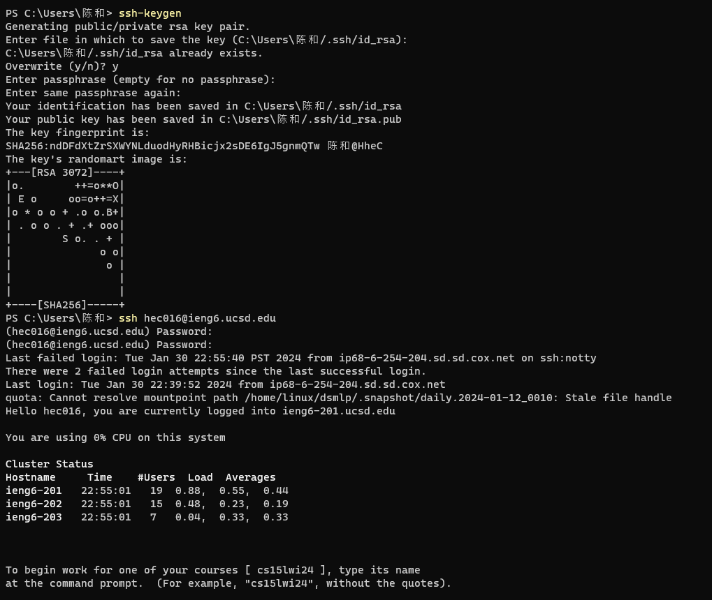
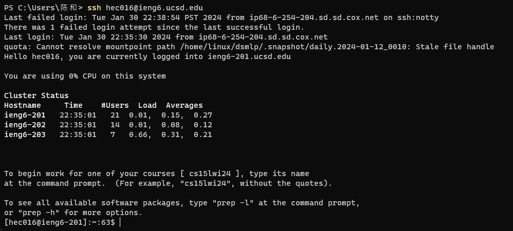

# CSE15L Lab2 Report

## Part 1

## ScreenShot of the code: 

## ScreenShot of using `/add-message`
* `/add-message?s=Hello&user=jpolitz`

1. Method called:
  * `handleRequest(URI url)`
  * `Map<String, String> parseQuery(String query)`
2. Relevant Arguments and Field Values:
  * `url` 
  * `string`
3. Values change:
  * `url` values changed, we add `/add-message?s=Hello&user=jpolitz` 
  * `String` values changed, we add the `username` and the `message` into the `string`

* `/add-message?s=How are you&user=yash`

1. Method called:
  * `handleRequest(URI url)`
  * `Map<String, String> parseQuery(String query)`
2. Relevant Arguments and Field Values:
  * `url` 
  * `string`
3. Values change:
  * `url` values changed, we add `/add-message?s=How are you&user=yash` 
  * `String` values changed, we add the `username` and the `message` into the `string`

## Part 2
1. private key:

2. public key:

3. without key:

## Part 3
* I have learned ssh to a remote server and how to run the server either on EdStem or on ieng6,
and interact with it by using the “path” and “query” I’ve also leared how to run the server on my
local computer, and lastly using SSH key to connect to ieng6 server without being asked for a
password

