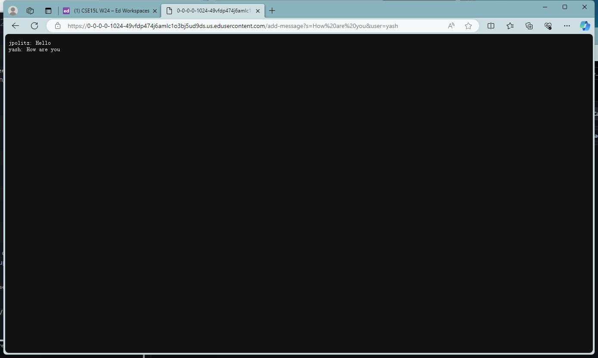

# CSE15L Lab2 Report

## Part 1

## ScreenShot of the code: 

## ScreenShot of using `/add-message`
* `/add-message?s=Hello&user=jpolitz`

1. Method called:
  * `handleRequest(URI url)`
  * `Map<String, String> parseQuery(String query)`
2. Relevant Arguments and Field Values:
  * `url` 
  * `string`
3. Values change:
  * `url` values changed, we add `/add-message?s=Hello&user=jpolitz` 
  * `String` values changed, we add the `username` and the `message` into the `string`

* `/add-message?s=How are you&user=yash`

1. Method called:
  * `handleRequest(URI url)`
  * `Map<String, String> parseQuery(String query)`
2. Relevant Arguments and Field Values:
  * `url` 
  * `string`
3. Values change:
  * `url` values changed, we add `/add-message?s=How are you&user=yash` 
  * `String` values changed, we add the `username` and the `message` into the `string`

## Part 2
1. private key:

